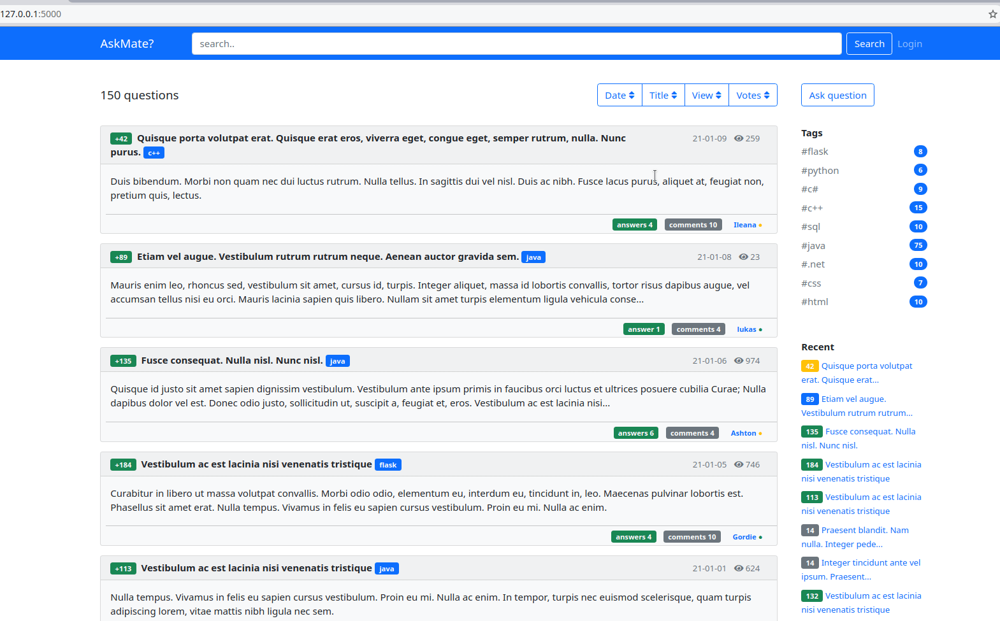
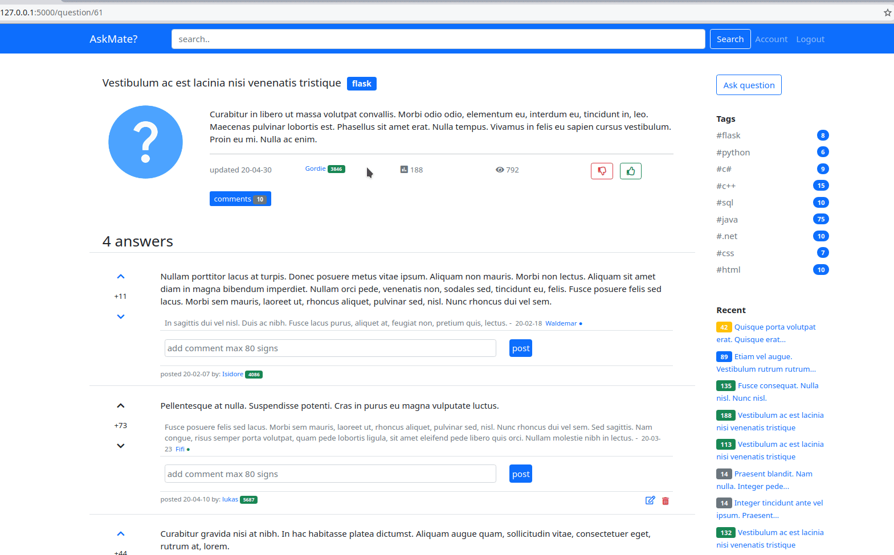

# AskMate (sprint 1)

This is a Q&A page, where you can ask questions and answers them. Like Reddit.

## Story

Its time to put your newly acquired Flask skills to use! Your next big task will be to implement a crowdsourced Q&A site, like Stack Overflow.

The initial version of the site should be able to handle questions and answers, there is no need for other functionality like user management or comments for questions/answers.

The management was very interested in the agile development methodologies that they just recently hear about, thus they are handing out a **prioritized list** of user stories called a product backlog. Try to estimate how many of these stories your team can finish until the demo. As the order is important, you should choose from the beginning of the list as much as you can, **the first four stories are the most important**.

## Implemented
- User registration
- User login
- Ask, edit, delete by question authenticated user 
- Post answers for questions, delete by logged user  
- Post comments for question and answers by logged user
- Like system
  - only logger user can vote for question and answer - once
  - user can't vote his own question or answers
  - each vote adds reputation point to question, answer author
- User system
- Tags

#### Index page and search module

#### User login, add, edit and remove question, answer, comment

#### Vote fro question and answer

#### User page

## Technologies

- Python
- Flask
- PostgreSql
- CSS
- Bootstrap 5.0
- HTML

## Install and run

- Install requirements.txt
- Create a database with PostgreSql
- virtualenv venv
- source venv/bin/activate
- venv/bin/pip install -r requirements.txt
- Create a postgreSql database, can use  database dump file located in askmate/data
- Setup the environment variables
  - PSQL_USER_NAME="username"
  - PSQL_PASSWORD="password"
  - PSQL_HOST="localhost"
  - PSQL_DB_NAME="database name"
  - SECRET_KEY="your secret key"
- Start run.py and open the page in a browser

